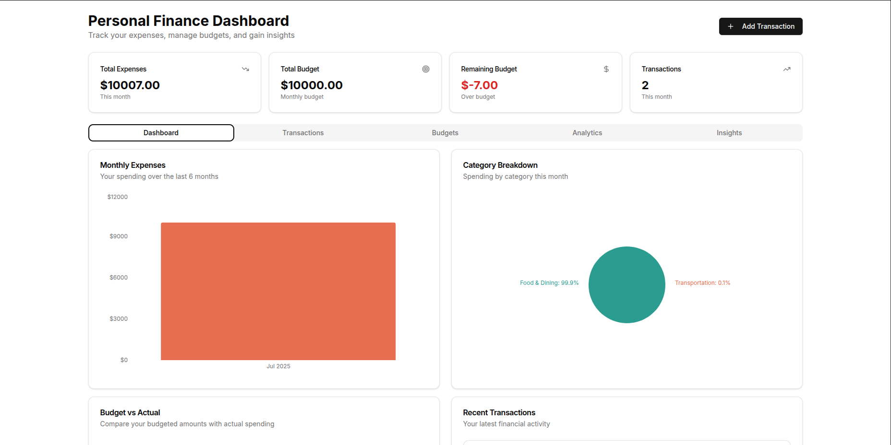
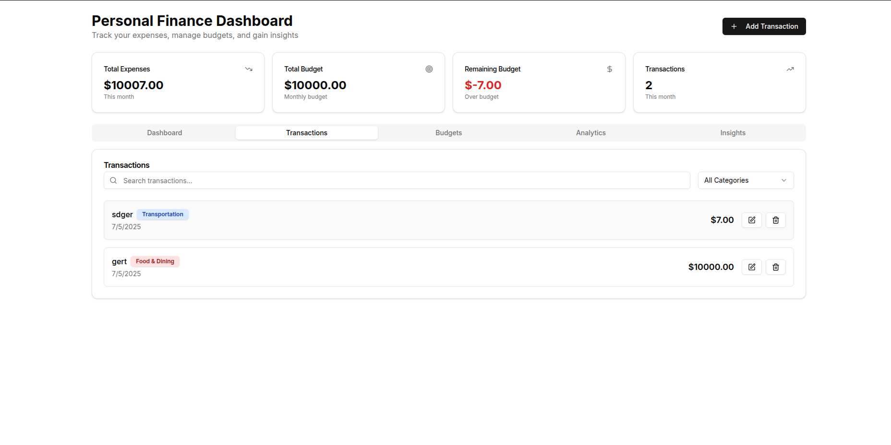
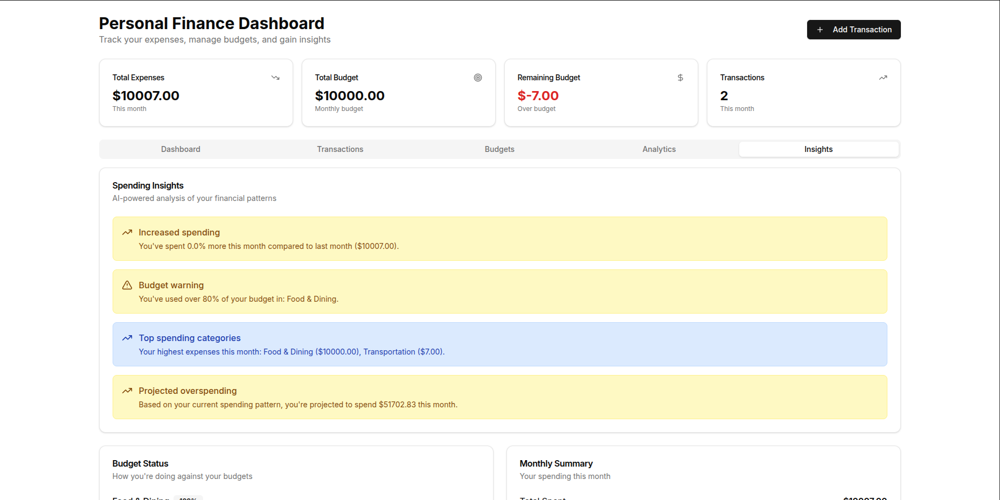
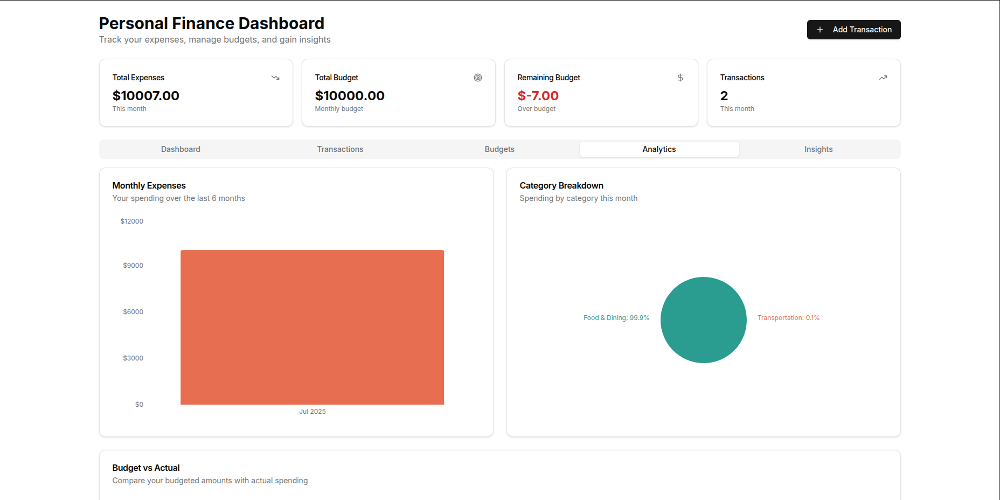

# 💸 Personal Finance Manager

A modern, full-stack web application for managing your personal finances. Track your budgets, monitor spending, and gain insights into your financial habits—all in a beautiful, intuitive interface.

---

## 🚀 Features

- **Budget Management:** Create, edit, and compare multiple budgets.
- **Transaction Tracking:** Add, view, and categorize your expenses and income.
- **Spending Insights:** Visualize your spending with charts and graphs.
- **Category Analysis:** See where your money goes with pie charts and monthly breakdowns.
- **Modern UI:** Built with Next.js, Tailwind CSS, and custom UI components for a seamless experience.
- **Persistent Storage:** Data is stored securely using MongoDB.

---

## 🛠️ Tech Stack

- [Next.js](https://nextjs.org/) (App Router)
- [TypeScript](https://www.typescriptlang.org/)
- [Tailwind CSS](https://tailwindcss.com/)
- [MongoDB](https://www.mongodb.com/)
- [Vercel Fonts (Geist)](https://vercel.com/font)

---

## ⚡ Getting Started

1. **Clone the repository:**
   ```bash
   git clone <your-repo-url>
   cd finance
   ```
2. **Install dependencies:**
   ```bash
   npm install
   # or
   yarn install
   ```
3. **Set up environment variables:**
   - Create a `.env.local` file in the root directory.
   - Add your MongoDB connection string:
     ```env
     MONGODB_URI=your_mongodb_connection_string
     ```
4. **Run the development server:**
   ```bash
   npm run dev
   # or
   yarn dev
   ```
5. **Open your browser:**
   Visit [http://localhost:3000](http://localhost:3000)

---

## 📁 Project Structure

- `app/` — Next.js app directory (pages, API routes, layout)
- `components/` — Reusable UI and feature components
- `hooks/` — Custom React hooks for data fetching and state
- `lib/` — Utility functions and database connection

---

## 📊 Screenshots





 |

---

## 🌐 Deployment

Deploy easily on [Vercel](https://vercel.com/) or your preferred platform.